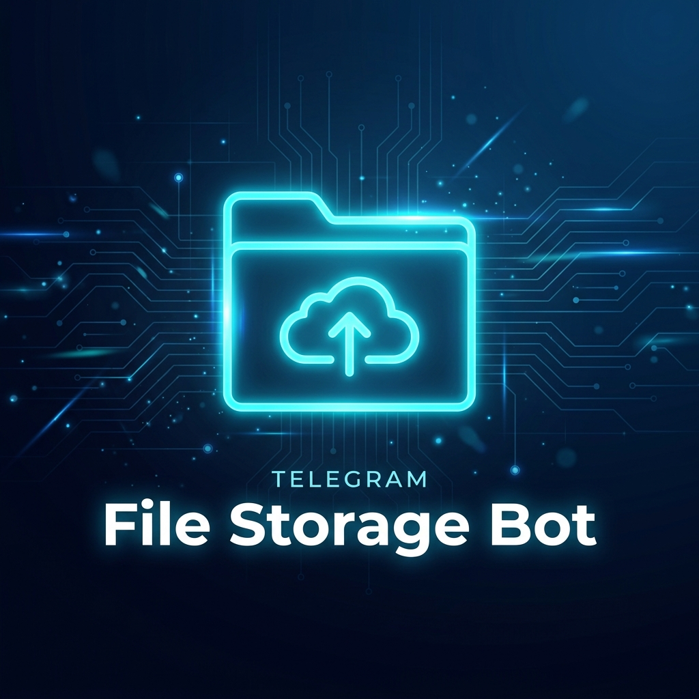

<p align="center">
  
</p>

<h1 align="center">📁 Telegram File Storage Bot</h1>

<p align="center">
  <b>Store, batch, and share Telegram files via unique shareable links</b>
</p>

<p align="center">
  <a href="#features">Features</a> •
  <a href="#deploy-to-heroku">Heroku</a> •
  <a href="#deploy-on-vps--rdp">VPS/RDP</a> •
  <a href="#docker">Docker</a> •
  <a href="#commands">Commands</a> •
  <a href="#license">License</a>
</p>

<p align="center">
  
  
  
  
</p>

---

## ✨ Features

| Feature | Description |
|---------|-------------|
| 📦 **Batch Storage** | Send multiple files/messages and generate a single share link |
| 🔗 **Unique Links** | Each batch gets a unique code — share via `t.me/YourBot?start=CODE` |
| 📨 **Forward Tag Control** | Choose to keep or remove the "Forwarded from" tag |
| 🔒 **Content Protection** | Optional restrict-saving/forwarding on delivered messages |
| ⏳ **Auto Expiry** | Set a day-based expiry on any batch |
| 📢 **Broadcast** | Owner can broadcast messages to all bot users |
| 📊 **Stats & User Tracking** | Owner panel for total users and batch statistics |

---

## 🔧 Prerequisites

Before deploying, you'll need:

| Item | Where to Get |
|------|-------------|
| `API_ID` & `API_HASH` | [my.telegram.org](https://my.telegram.org) → API Development Tools |
| `BOT_TOKEN` | [@BotFather](https://t.me/BotFather) on Telegram |
| `STORAGE_CHANNEL` | Create a **private channel**, add your bot as **admin** with post permission, then get the channel ID (use [@userinfobot](https://t.me/userinfobot) by forwarding a message from the channel) |
| `OWNER_ID` | Your Telegram user ID (use [@userinfobot](https://t.me/userinfobot)) |

---

## 🚀 Deploy to Heroku

The quickest way to get started:

[](https://heroku.com/deploy?template=https://github.com/yourusername/Telegram-File-Storage-Bot)

> **After deploying:** Go to your app's **Resources** tab, disable the `web` dyno (if any), and enable the `worker` dyno.

### Manual Heroku Setup

```bash
# Clone the repository
git clone https://github.com/yourusername/Telegram-File-Storage-Bot.git
cd Telegram-File-Storage-Bot

# Login to Heroku
heroku login

# Create app
heroku create your-app-name

# Set environment variables
heroku config:set API_ID=12345678
heroku config:set API_HASH=your_api_hash
heroku config:set BOT_TOKEN=your_bot_token
heroku config:set BOT_USERNAME=YourBotUsername
heroku config:set STORAGE_CHANNEL=-100123456789
heroku config:set OWNER_ID=123456789

# Deploy
git push heroku main

# Scale worker
heroku ps:scale worker=1
```

---

## 🖥️ Deploy on VPS / RDP

### Step 1 — Clone & Setup

```bash
# Clone the repo
git clone https://github.com/yourusername/Telegram-File-Storage-Bot.git
cd Telegram-File-Storage-Bot

# Install Python dependencies
pip install -r requirements.txt
```

### Step 2 — Configure Environment

```bash
# Copy the example env file
cp .env.example .env

# Edit with your credentials
nano .env
```

Fill in your values:

```env
API_ID=12345678
API_HASH=your_api_hash_here
BOT_TOKEN=your_bot_token_here
BOT_USERNAME=YourBotUsername
STORAGE_CHANNEL=-100123456789
OWNER_ID=123456789
WELCOME_VIDEO_URL=
```

### Step 3 — Load Environment & Run

```bash
# Load env vars and start the bot
export $(cat .env | xargs) && python bot.py
```

### Run in Background (recommended)

Using **screen**:
```bash
screen -S filebot
export $(cat .env | xargs) && python bot.py
# Press Ctrl+A then D to detach
```

Using **systemd** (create `/etc/systemd/system/filebot.service`):
```ini
[Unit]
Description=Telegram File Storage Bot
After=network.target

[Service]
Type=simple
User=root
WorkingDirectory=/root/Telegram-File-Storage-Bot
EnvironmentFile=/root/Telegram-File-Storage-Bot/.env
ExecStart=/usr/bin/python3 bot.py
Restart=always
RestartSec=10

[Install]
WantedBy=multi-user.target
```

Then:
```bash
sudo systemctl daemon-reload
sudo systemctl enable filebot
sudo systemctl start filebot
```

---

## 🐳 Docker

### Build & Run

```bash
git clone https://github.com/yourusername/Telegram-File-Storage-Bot.git
cd Telegram-File-Storage-Bot

# Build the image
docker build -t file-storage-bot .

# Run with environment variables
docker run -d --name file-storage-bot \
  -e API_ID=12345678 \
  -e API_HASH=your_api_hash \
  -e BOT_TOKEN=your_bot_token \
  -e BOT_USERNAME=YourBotUsername \
  -e STORAGE_CHANNEL=-100123456789 \
  -e OWNER_ID=123456789 \
  file-storage-bot
```

### Docker Compose

Create a `docker-compose.yml`:

```yaml
version: "3.8"
services:
  bot:
    build: .
    container_name: file-storage-bot
    restart: always
    env_file:
      - .env
```

Then run:
```bash
docker compose up -d
```

---

## 🔄 Updating

Pull the latest changes and restart:

```bash
# On VPS/RDP
cd Telegram-File-Storage-Bot
git pull origin main
pip install -r requirements.txt
# Restart your bot (systemctl restart filebot / or re-run)

# On Heroku
git pull origin main
git push heroku main

# On Docker
docker compose down
git pull origin main
docker compose up -d --build
```

---

## 📋 Commands

| Command | Description | Access |
|---------|-------------|--------|
| `/start` | Start the bot & show menu | Everyone |
| `/add` | Begin adding messages to a new batch | Everyone |
| `/done` | Finish current batch & get the share link | Everyone |
| `/my_batches` | View all your created batch links | Everyone |
| `/delete <code>` | Delete a specific batch | Owner of batch |
| `/exp <code> <days>` | Set expiry (in days) for a batch | Owner of batch |
| `/broadcast <msg>` | Send a message to all bot users | Bot Owner only |

---

## 📁 Project Structure

```
Telegram-File-Storage-Bot/
├── bot.py              # Main bot source code
├── requirements.txt    # Python dependencies
├── Procfile            # Heroku worker config
├── runtime.txt         # Python version for Heroku
├── Dockerfile          # Docker deployment
├── app.json            # Heroku one-click deploy config
├── .env.example        # Example environment variables
├── .gitignore          # Git ignore rules
└── assets/
    └── banner.png      # Repository banner image
```

---

## ⚙️ Environment Variables

| Variable | Required | Description |
|----------|----------|-------------|
| `API_ID` | ✅ | Telegram API ID |
| `API_HASH` | ✅ | Telegram API Hash |
| `BOT_TOKEN` | ✅ | Bot token from BotFather |
| `BOT_USERNAME` | ✅ | Bot username (without @) |
| `STORAGE_CHANNEL` | ✅ | Private channel ID for storing files |
| `OWNER_ID` | ✅ | Your Telegram user ID |
| `WELCOME_VIDEO_URL` | ❌ | URL to a welcome video (optional) |

---

## 📄 License

This project is licensed under the [MIT License](LICENSE).

---

<p align="center">
  <b>⭐ Star this repo if you found it useful!</b>
</p>
